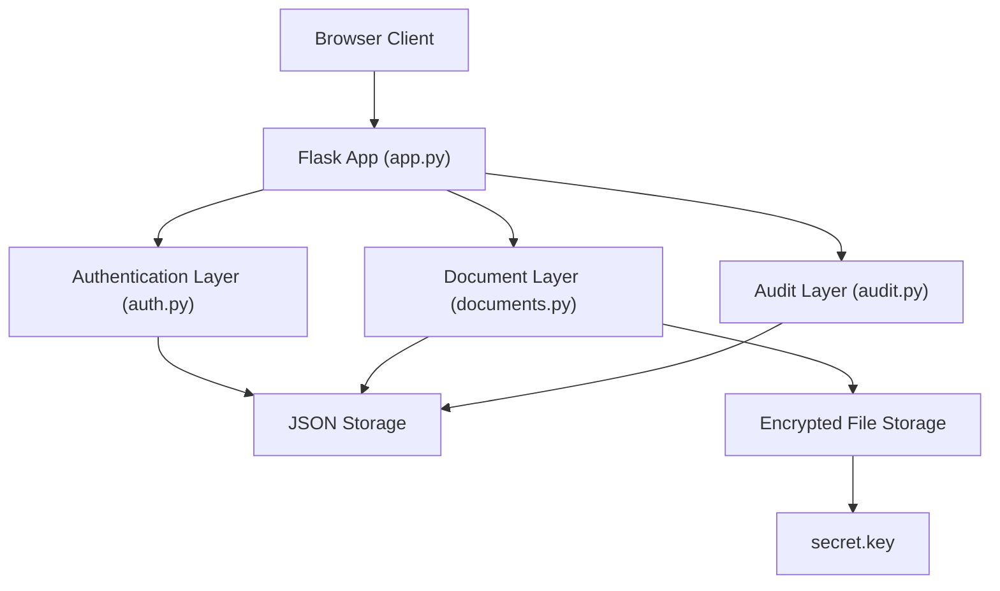
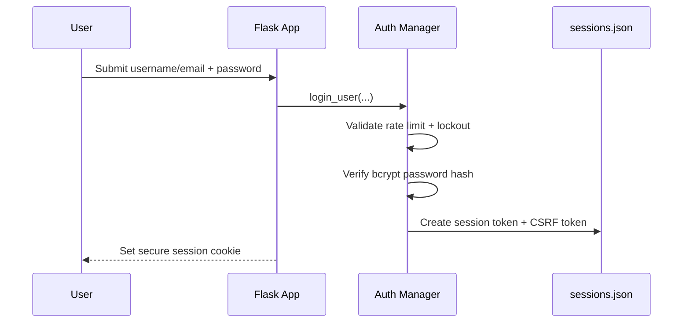
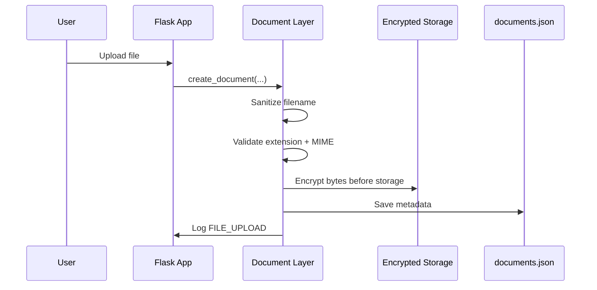

# Security Design Document

## Project Information

- Project: Secure Document Sharing System
- Course: CS 419 Secure Web Application Project
- Team Members:
  - Yung Hao Sun
  - Victor Mai
- Technology Stack:
  - Python
  - Flask
  - JSON file-based storage
  - `bcrypt`
  - `cryptography.fernet`
  - HTML/CSS/JavaScript

---

## 1. Introduction

### 1.1 Project Purpose

This project is a secure web application for document upload, download, sharing, and auditing. The system allows authenticated users to manage files while enforcing security controls required by the course project specification.

### 1.2 Security Goals

The main security goals of the project are:

- protect user credentials
- restrict document access to authorized users only
- encrypt files stored on disk
- maintain secure session handling
- log important security and document events
- reduce risk from common web attacks such as brute force login attempts, forced browsing, insecure uploads, and session misuse

### 1.3 Scope

This document covers the actual security design implemented in the codebase, including:

- authentication and access control
- input validation
- encryption and key handling
- session security
- security headers
- logging and audit trail design

It also notes important limitations where the current project uses a lightweight academic implementation instead of a production-grade design.

---

## 2. Architecture Overview

### 2.1 High-Level System Design

The application uses a simple layered structure:



### 2.2 Main Components

#### `app.py`

Responsible for:

- Flask app creation
- route handling
- role checks
- CSRF enforcement
- session loading
- HTTPS configuration
- security header configuration

#### `auth.py`

Responsible for:

- registration validation
- password hashing with `bcrypt`
- login verification
- account lockout
- login rate limiting
- session creation and validation
- session binding checks
- security event logging

#### `documents.py`

Responsible for:

- secure upload handling
- encrypted file storage
- document metadata storage
- version history
- document sharing
- file-level authorization checks

#### `audit.py`

Responsible for:

- audit trail storage
- audit event creation
- recent event retrieval

### 2.3 Data Storage Model

The project uses JSON files instead of SQL. This matches the style used by the course project examples and keeps the system simple for a course deployment.

Tracked runtime storage:

- `data/users.json`
- `data/sessions.json`
- `data/login_attempts.json`
- `data/documents.json`
- `data/shares.json`
- `data/audit_trail.json`

Encrypted files are stored separately in:

- `data/encrypted/`

### 2.4 Why JSON Storage Was Used

JSON file-based persistence was chosen because:

- it matches the lightweight scope of the assignment
- it is easy to inspect during development and testing
- it supports demonstrating security logic clearly

Limitations:

- weaker concurrency guarantees than a database
- higher risk of corruption if not carefully written
- not appropriate for high-scale production use

This limitation was partially reduced in the project by adding safer write behavior for session and audit storage.

---

## 3. Threat Model

### 3.1 Assets

Important assets in the system include:

- password hashes
- session tokens
- encryption key
- encrypted uploaded files
- document metadata
- user role assignments
- audit logs and security logs

### 3.2 Threat Actors

The system is primarily designed to defend against:

- unauthenticated external attackers
- authenticated low-privilege users attempting privilege escalation
- users attempting unauthorized document access
- attackers trying to abuse sessions or file uploads

### 3.3 Key Threats Considered

| Threat | Example |
|---|---|
| Credential attacks | brute-force login attempts |
| Session abuse | replaying or stealing session tokens |
| Access control bypass | downloading another user's unshared file |
| File upload abuse | uploading disallowed or disguised file types |
| Tampering | modifying runtime JSON state or document metadata |
| Repudiation | denying a share, update, or delete action |
| Information disclosure | exposing confidential documents to unauthorized users |

### 3.4 Risk Summary

| Threat | Likelihood | Impact | Notes |
|---|---|---|---|
| Brute-force login | High | Medium | mitigated with rate limiting and lockout |
| Unauthorized document access | Medium | High | mitigated with system and document role checks |
| Session replay | Medium | High | mitigated with session binding and timeout |
| Unsafe upload handling | Medium | High | mitigated with extension and MIME restrictions |
| JSON storage corruption | Low | Medium | partially mitigated with safer write behavior |

---

## 4. Security Controls

### 4.1 Authentication Security

The application protects authentication with:

- password policy enforcement during registration
- password hashing using `bcrypt`
- duplicate username/email checks
- account lockout after 5 failed attempts for 15 minutes
- IP rate limiting of 10 login attempts per minute

Example implementation pattern from [auth.py](C:/Users/Owner/Documents/codes/CS419Proj/auth.py):

```python
password_hash = bcrypt.hashpw(
    password.encode("utf-8"),
    bcrypt.gensalt(rounds=12),
).decode("utf-8")
```

### 4.2 Authorization and Access Control

The application uses two access-control layers.

#### System Roles

- `admin`
- `user`
- `guest`

#### Document Roles

- `owner`
- `editor`
- `viewer`

System role controls platform-level privileges, while document role controls access to individual files.

Examples:

- admins can view all content and manage users
- guests can only view/download allowed content
- owners can share and manage their documents
- editors can upload new versions
- viewers can read/download only

### 4.3 Session Security

Session controls implemented in the project:

- random server-generated session tokens
- session timeout
- logout removes the current session
- invalid session token logging
- session binding to original IP and user agent
- CSRF token stored per session and required for authenticated POST requests

Session structure includes:

- `token`
- `user_id`
- `created_at`
- `last_activity`
- `ip_address`
- `user_agent`
- `csrf_token`

### 4.4 Input Validation and Upload Security

The upload flow uses:

- `secure_filename(...)`
- extension allowlist
- MIME allowlist
- extension-to-MIME matching
- controlled encrypted storage directory

This helps reduce:

- path traversal risk
- unsafe extension uploads
- mismatched upload type abuse

### 4.5 Encryption and Transport Security

#### Data At Rest

Uploaded files are encrypted before being written to disk using `cryptography.fernet`.

#### Data In Transit

The Flask app supports HTTPS using:

- `cert.pem`
- `key.pem`

The app can run locally over TLS and includes optional HTTPS enforcement behavior.

### 4.6 Security Headers

The application sets the following response headers:

- `Content-Security-Policy`
- `X-Frame-Options`
- `X-Content-Type-Options`
- `Referrer-Policy`
- `Permissions-Policy`
- `Strict-Transport-Security`

These reduce client-side attack surface such as clickjacking and unsafe resource loading.

### 4.7 Logging and Monitoring

The project includes two kinds of logging:

#### Security Log

Stored in:

- `logs/security.log`

Examples of logged events:

- login success/failure
- account lockouts
- rate limiting
- invalid session tokens
- CSRF validation failures
- session binding mismatches

#### Audit Trail

Stored in:

- `data/audit_trail.json`

Examples of logged events:

- file upload
- file download
- file share / unshare
- share role update
- file update
- file delete
- admin role changes

---

## 5. Data Flow and Security Workflow

### 5.1 Login Flow



### 5.2 Upload Flow



### 5.3 Sharing Flow

The sharing flow requires:

- authenticated user
- valid CSRF token
- owner authorization
- valid target username
- allowed share role (`viewer` or `editor`)

The system then:

- updates the document share metadata
- updates the share index
- writes an audit entry

---

## 6. Mapping To Project PDF Requirements

This section ties the implementation directly to the PDF-style requirements.

### 6.1 Authentication and Access Control

Implemented:

- registration
- login/logout
- password hashing
- password complexity checks
- account lockout
- rate limiting
- session creation
- system roles
- document roles

### 6.2 Input Validation

Implemented:

- filename sanitization
- upload extension restrictions
- MIME restrictions
- route-level validation of required fields

### 6.3 Encryption

Implemented:

- encrypted file storage
- local TLS support
- separate encryption key file

### 6.4 Session Management

Implemented:

- session token creation
- timeout handling
- logout
- session binding checks
- CSRF tokens for authenticated POST requests

### 6.5 Security Headers

Implemented:

- CSP
- HSTS
- anti-clickjacking and content-type protections

### 6.6 Logging and Monitoring

Implemented:

- security log
- audit trail
- document activity logging
- authorization failure logging
- validation failure logging

---

## 7. Data Protection

### 7.1 Data Classification

| Data Type | Classification |
|---|---|
| Password hashes | Sensitive |
| Session tokens | Sensitive |
| Encryption key | Highly sensitive |
| Uploaded files | Confidential |
| Audit logs | Internal |
| Usernames/emails | Internal / sensitive |

### 7.2 Encryption Method

Uploaded files are encrypted with Fernet before storage. This provides confidentiality for stored files if the disk contents are accessed without the application.

### 7.3 Key Management

The encryption key is stored in:

- `secret.key`

Strengths:

- stored separately from encrypted files
- not committed to Git
- loaded at runtime

Limitations:

- local file-based key storage
- no key rotation
- no dedicated secret-management service

### 7.4 Secure Deletion

Current behavior:

- documents are soft-deleted in metadata
- deleted records remain in audit/history context

Limitation:

- this is not full secure overwrite or cryptographic erasure

For a course project, this supports accountability and recovery, but it is not a production-grade secure deletion design.

---

## 8. Limitations and Future Improvements

The current implementation is appropriate for a course project, but several improvements would be needed in a production system.

### 8.1 Storage Limitations

- replace JSON files with a transactional database such as PostgreSQL
- improve cross-process locking and consistency guarantees

### 8.2 Upload Hardening

- content-based file inspection
- stronger malware scanning if required

### 8.3 Key Management

- external key vault / secret manager
- key rotation support

### 8.4 Session Security

- optional stricter concurrent-session controls
- richer device/session management UI

### 8.5 Deployment Hardening

- production WSGI server
- reverse proxy for HTTPS redirect handling
- trusted CA certificate instead of self-signed development cert

---

## 9. Conclusion

The Secure Document Sharing System implements the major security controls required by the project specification using a practical Flask-based design. The current codebase includes authentication protections, role-based authorization, encrypted storage, session security, CSRF protection, upload validation, HTTPS support, logging, and audit visibility. While the project uses simplified storage and local key handling suitable for an academic environment, the implemented design still demonstrates the core security principles expected for the assignment.

